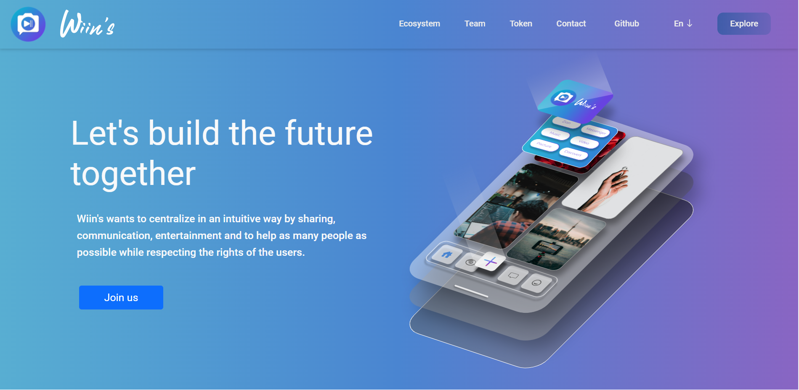

[![Contributors][contributors-shield]][contributors-url]
[![Forks][forks-shield]][forks-url]
[![Stargazers][stars-shield]][stars-url]
[![Issues][issues-shield]][issues-url]
[![Discord][discord-shield]][discord-url]

<br />

<!-- Introduction -->

## Wiins.io

<a href="https://discord.gg/JXs3MxAn">

</a>

Wiins is a social media with the particularity of centralizing all web functions to improve the entertainment, security, comfort and ease of use.
<br />

<!-- Links -->

## Link to access the platform

- <a href="https://www.wiins.io/">Link of the platform (prod)</a>
- <a href="https://github.com/etsraphael/WiinsWebDapp">Link of the web platform on git</a>
- <a href="https://pancakeswap.finance/swap?inputCurrency=0x55d398326f99059ff775485246999027b3197955&outputCurrency=0xC959D6388058a326c59508e2beAB8Be12de4E0C3&exactAmount=50">Link of the TEA token</a>

<br />

<!-- Server -->

## Development server

When you are on the project, install all dependencies by running

```sh
npm install
```

To launch the server, run

```sh
ng serve
```

The command before each commit for clean your code. This command will run before each commit.

```sh
npm run pre-commit: "npm run prettier && ng test --browsers ChromeHeadless --watch=false && ng lint"
```

<br />

<!-- Important -->

## Important to know

- Join our discord <a href="https://discord.gg/JXs3MxAn">WiinsCommunity</a>. The community can talk about a task and help each other. A reward will be split only if the owner of the pushed branch assures to <a href="https://twitter.com/iamraphaelsalei">iamraphaelsalei</a> the participation.
- On discord, everyone can know more about the company. (History of rewards, future update, special challenge, etc.. )
- Even if your update is not mentioned. Anyone can push a new version which can improve the platform (the administrators can merge if they deem the idea necessary)
- Don't forget to share the project, more we have in the community, better the updates, and better the rewards

<br />

<!-- Rules -->

## Rules for the rewards

- The code have to be commented and simplified for all of the community
- Make sure you choose the right branch
- The reward will be given only for the owner(s) who gets the validated branch

<br />

<!-- Caution -->

## Caution

- Make sure you have the right bitcoin address, no refund can be made otherwise
- Only the twitter of <a href="https://twitter.com/iamraphaelsalei">iamraphaelsalei</a> is official. Don't send donations to other bitcoin addresses. (Make sure during the donation, <span style="color: #3794ff">iamraphaelsalei</span> is to the owner of the publication)

<br />

<!-- TEA Token -->

## Community

Be the first to contribute to our project by purchasing and staking our token !
You'll be able to :

- ✔️ Stake and earn TEA at the same time
- ✔️ Use 100% of the platform with full content available to a subscription
- ✔️ Wiin's certified Artist can be rewarded to personalize monetary gifts

Join the winns comuntiy today and lets grow TEA worth together 🚀
<br />
<br />
<br />

<p align="center">
<a href="https://discord.gg/JXs3MxAn">

</a>
</p>
<!-- MARKDOWN LINKS & IMAGES -->
<!-- https://www.markdownguide.org/basic-syntax/#reference-style-links -->

[contributors-shield]: https://img.shields.io/github/contributors/etsraphael/WiinsWebDapp.svg?style=for-the-badge
[contributors-url]: https://github.com/etsraphael/WiinsWebDapp/graphs/contributors
[forks-shield]: https://img.shields.io/github/forks/etsraphael/WiinsWebDapp.svg?style=for-the-badge
[forks-url]: https://github.com/etsraphael/WiinsWebDapp/network/members
[stars-shield]: https://img.shields.io/github/stars/etsraphael/WiinsWebDapp.svg?style=for-the-badge
[stars-url]: https://github.com/etsraphael/WiinsWebDapp/stargazers
[issues-shield]: https://img.shields.io/github/issues/etsraphael/WiinsWebDapp.svg?style=for-the-badge
[issues-url]: https://github.com/etsraphael/WiinsWebDapp/issues
[discord-shield]: https://img.shields.io/badge/-Discord-black.svg?style=for-the-badge&logo=discord&colorB=555
[discord-url]: https://discord.gg/JXs3MxAn
[product-screenshot]: images/screenshot.png
